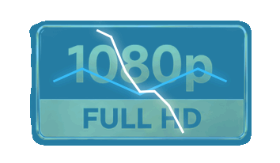
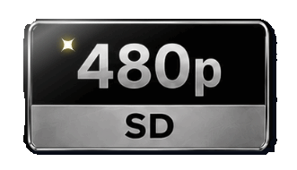
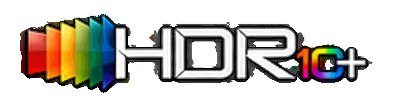
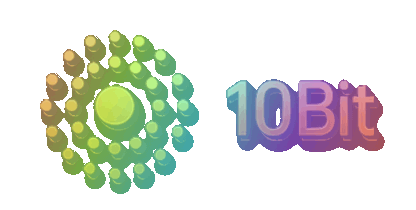

# 💎 Badges-Vip: Modern Animated Media Badges

> **Bộ sưu tập 128 huy hiệu (badges) động định dạng `.gif` phong cách Darpit Animated Deluxe: glitch RGB, khói–mực, scan điện ảnh, light burst và sóng không gian dành cho VidHub, Infuse, Jellyfin, Plex, Kodi, Stremio.**

[](#)
[](#)
[](#)
[](#)

---

## 🚀 Cách sử dụng (Quick Setup)

### Link cấu hình trực tiếp:
Sử dụng đường dẫn file cấu hình JSON sau trong ứng dụng của bạn (VidHub / Infuse / Media Player):
```text
https://raw.githubusercontent.com/9000000/Badges-Vip/tet/badges.json
```

---

## 🎬 Bộ huy hiệu cốt lõi (31 Badges)

### 1. Nguồn phát (Source)
| Tên | Huy hiệu | Hiệu ứng |
| :--- | :---: | :--- |
| **REMUX** |  | Glitch RGB dạng lỏng + Ngôi sao Darpit |
| **Blu-ray Disc** |  | Glitch RGB xanh điện ảnh + Ngôi sao Darpit |
| **WEB-DL** |  | Glitch dữ liệu cyan + Ngôi sao Darpit |
| **WEBRip** |  | Glitch dữ liệu tím + Ngôi sao Darpit |
| **HDTV** |  | Glitch tín hiệu cyan + Ngôi sao Darpit |
| **DVD RIP** |  | Glitch vàng kim + Ngôi sao Darpit |

---

### 2. Độ phân giải (Resolution)
| Tên | Huy hiệu | Hiệu ứng |
| :--- | :---: | :--- |
| **4K Ultra HD** |  | Hiện hình bằng khói–mực xanh lục |
| **1080p Full HD** |  | Hiện hình bằng khói–mực xanh lam |
| **720p HD** |  | Hiện hình bằng khói–mực cyan |
| **480p SD** |  | Hiện hình bằng khói–mực ánh bạc |

---

### 3. Công nghệ Video & HDR (Video Tech)
| Tên | Huy hiệu | Hiệu ứng |
| :--- | :---: | :--- |
| **Dolby Vision** |  | Scan lăng kính hồng theo chiều ngang |
| **HDR10+** |  | Light burst vàng kim |
| **HDR10** |  | Light burst vàng kim |
| **HDR** |  | Light burst cam rực |
| **SDR** |  | Light burst ánh bạc |
| **IMAX Enhanced** |  | Scan điện ảnh xanh lam |
| **IMAX** |  | Scan màn ảnh rộng xanh lam |

---

### 4. Codec Video & Độ sâu màu (Codec & Bit Depth)
| Tên | Huy hiệu | Hiệu ứng |
| :--- | :---: | :--- |
| **HEVC (H.265)** |  | Glitch ma trận xanh lục |
| **AVC (H.264)** |  | Glitch dữ liệu tím |
| **10Bit** |  | Light burst quang phổ |
| **8Bit** |  | Light burst tín hiệu cyan |

---

### 5. Công nghệ Âm thanh (Audio Tech)
| Tên | Huy hiệu | Hiệu ứng |
| :--- | :---: | :--- |
| **Dolby Atmos** |  | Sóng không gian cyan hội tụ |
| **TrueHD** |  | Sóng Lossless xanh lam hội tụ |
| **Dolby Digital Plus** |  | Sóng âm tím hội tụ |
| **Dolby Digital** |  | Sóng âm xanh lam hội tụ |
| **DTS:X** |  | Light burst cam từ tâm chữ X |
| **DTS-HD Master Audio** |  | Light burst vàng kim |
| **DTS-HD** |  | Light burst cam |
| **DTS** |  | Light burst cam |

---

### 6. Kênh Âm thanh (Audio Channels)
| Tên | Huy hiệu | Hiệu ứng |
| :--- | :---: | :--- |
| **7.1 Audio** |  | Sóng không gian 7.1 hội tụ |
| **5.1 Audio** |  | Sóng không gian 5.1 hội tụ |

---

## ✨ Bộ nhãn mở rộng (97 Badges)

| Nhóm | Số lượng mới | Nội dung |
| :--- | ---: | :--- |
| Special Tags | 15 | SEADEX, HYBRID, CRITERION, PROPER, REPACK, REMASTERED, OPEN MATTE, REGRADED, DIR CUT, EXTENDED, UNCUT, UNCENSORED, BLACK & WHITE, TRUE-HUE, THTR |
| Source | 17 | REMUX 1–3, BLU-RAY 1–8, WEB 1–6 |
| Resolution | 5 | 1440p, 576p, 360p, 240p, 144p |
| Quality | 6 | HDRip, HC HDRip, SCR, TC, TS, CAM |
| Video Tech | 5 | DV · HDR10+, DV · HDR10, DV · HDR, HLG, AI |
| Audio Tech | 8 | ATMOS TRUEHD, DTS:X HD MA, ATMOS DIGITAL+, DTS:X HD, FLAC, DTS-ES, OPUS, AAC |
| Audio Channels | 2 | 6.1, 2.0 |
| Video Codec | 3 | AV1, XviD, DivX |
| Streaming | 9 | PEACOCK, NETFLIX, PRIME VIDEO, APPLE TV+, DISNEY+, HBO MAX, HULU, PARAMOUNT+, CRUNCHYROLL |
| Language | 27 | ENG, ESP, LAT, SPA, FRE, GER, ITA, BRA, POR, TUR, POL, UKR, IND, THA, VIE, JPN, KOR, CHI, HIN, ARA, RUS, GRE, CZE, SVK, SLO, SWE, MUL |

Các nhãn chỉ khác cách viết nhưng trùng nghĩa với bộ cốt lõi đã được loại bỏ để tránh hiển thị hai badge cho cùng một thuộc tính.

---

## 🛠 Tùy biến & Tái tạo (Development)

Cài đặt dependencies và tạo lại toàn bộ file GIF:
```bash
npm install
npm run generate
```

Bộ cốt lõi dùng 150 khung hình ở 30 ms/khung; bộ mở rộng dùng 90 khung hình ở 50 ms/khung để tối ưu dung lượng. Cả hai đều lặp vô hạn trong 4,5 giây với glow màu, quét sáng, hạt năng lượng và sparkle chuyển động. Chỉ tạo lại một số badge khi phát triển:
```bash
node scripts/generate_badges.js --only=remux.gif,4k_ultra_hd.gif
```

Nhập lại danh sách tham khảo và chỉ tạo bộ mở rộng:
```bash
npm run import:reference
npm run generate -- --imported
```

Xem trước toàn bộ bộ sưu tập tương tác:
Mở file `badge_link_preview.html`, nhập link `badges.json` và bấm **Tải danh sách**.

---

## 📄 License
MIT License © 2026 9000000
